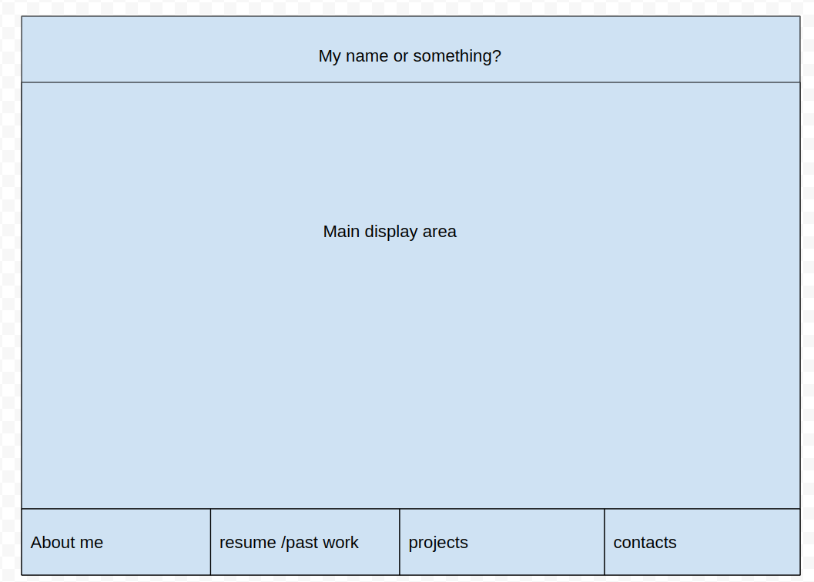
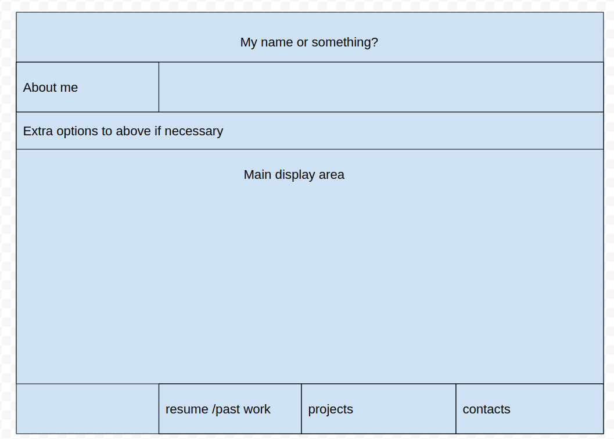

# James Stoppani's Portfolio Site

## Technologies Used:
    
The site is programmed using HTML, CSS, and Javascript and hosted on Github pages.

## Installation Instructions:
### There are 2 main ways to access the site:
    
1 - Visit the webpage at https://jamesstop.github.io/JamesStoppaniPortfolioSite/

2 - Clone down the fork and/or clone down the repository and from with the project's folder you can open the html file through whichever method you most prefer and you should have full access to the site locally.

## Programming Approach

For this project, I approached it with a very simply wireframe with a base navigation bar functionality:

The first wireframe above highlights what I wanted from the default layout of the page when viewing it for the first time.

The second wireframe above highlights the basic interactive concept I wanted the navigation to be based around. For that I imagined the nav bar starting at the bottom of the screen, and as you scroll down the page to each section that piece of the nav bar moves with the page to act as a header for the section below it. With each new section, the nav bars scroll with their respective section revealing new displays and options pertaining to said section.

## Unsolved problems

I wanted to add some extra interactive elements (header that starts at full screen, etc.), as well as some better cloud images for aesthetic preferences. The first issue had worked in a previous version, after some changes I realized it no longer worked the same way and would need more messing with than before. As for the second thing, finding good cloud pngs using opacity and clear backgrounds would require me to either make them myself or find an artist for a commission as finding good free alternatives proved very difficult.